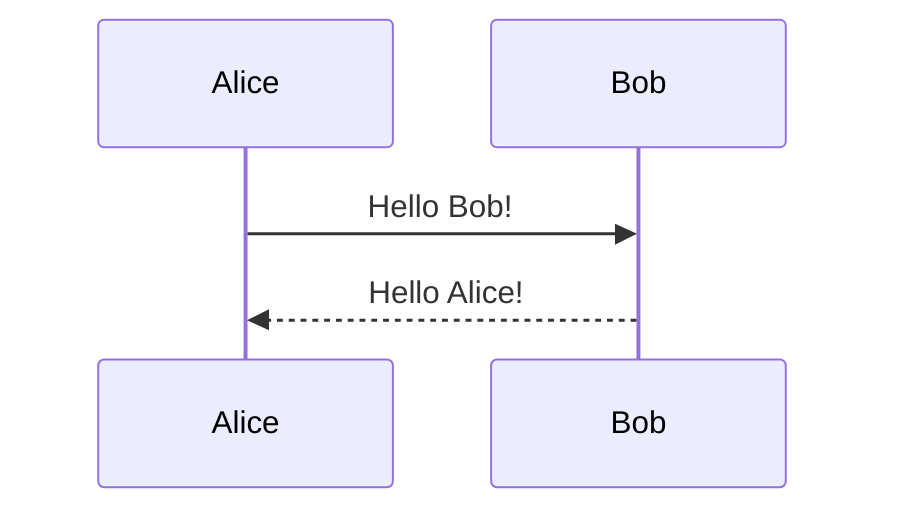

# Complete Guide to Writing Posts

This comprehensive guide covers all available features and formatting options for writing posts in this Jekyll-based academic website. Each feature includes examples and implementation details.

## Table of Contents

- [Front Matter Configuration](#front-matter-configuration)
- [Basic Formatting](#basic-formatting)
- [Images and Media](#images-and-media)
- [Code and Syntax Highlighting](#code-and-syntax-highlighting)
- [Mathematical Content](#mathematical-content)
- [Interactive Elements](#interactive-elements)
- [Layouts and Organization](#layouts-and-organization)
- [Advanced Features](#advanced-features)
- [Bootstrap Classes Reference](#bootstrap-classes-reference)

## Front Matter Configuration

Every post starts with YAML front matter containing metadata and configuration options:

### Essential Front Matter

```yaml
---
layout: post # Layout type: post, distill, or page
title: "Your Post Title" # Post title
date: 2024-01-15 10:30:00 # Publication date (YYYY-MM-DD HH:MM:SS)
description: "Brief post description" # Meta description for SEO
tags: tag1 tag2 tag3 # Space-separated tags
categories: sample-posts # Post categories
---
```

### Optional Front Matter

```yaml
---
# Visual settings
thumbnail: assets/img/thumbnail.jpg    # Post thumbnail image
featured: true                        # Feature this post

# Comment systems
giscus_comments: true                 # Enable Giscus comments
disqus_comments: true                 # Enable Disqus comments

# Related content
related_posts: true                   # Show related posts
related_publications: true            # Show related publications

# Table of contents
toc:
  beginning: true                     # Add TOC at beginning
  # OR for distill layout:
  - name: Section 1
    subsections:
      - name: Subsection 1.1
      - name: Subsection 1.2
  - name: Section 2

# Feature toggles
pretty_table: true                    # Enable Bootstrap tables
tabs: true                           # Enable tab functionality
pseudocode: true                     # Enable pseudocode rendering
tikzjax: true                        # Enable TikZ diagrams
code_diff: true                      # Enable code diff highlighting
map: true                            # Enable map functionality

# Media galleries
images:
  compare: true                      # Enable image comparison
  slider: true                       # Enable image slider
  lightbox2: true                    # Enable Lightbox2 gallery
  photoswipe: true                   # Enable PhotoSwipe gallery
  spotlight: true                    # Enable Spotlight gallery
  venobox: true                      # Enable Venobox gallery

# Charts and visualizations
mermaid:
  enabled: true                      # Enable Mermaid diagrams
  zoomable: true                     # Make diagrams zoomable

chart:
  chartjs: true                      # Enable Chart.js
  echarts: true                      # Enable ECharts
  vega_lite: true                    # Enable Vega-Lite

# Distill-specific (for distill layout)
authors:
  - name: Author Name
    url: "https://author.website"
    affiliations:
      name: Institution

bibliography: filename.bib           # Bibliography file
---
```

## Basic Formatting

### Text Formatting

```markdown
**Bold text** or **bold text**
_Italic text_ or _italic text_
~~Strikethrough text~~
`Inline code`

> Blockquotes for important text
> Multi-line blockquotes work too

## Headers

### Sub-headers

#### Sub-sub-headers
```

### Lists

```markdown
# Unordered lists

- Item 1
- Item 2
  - Nested item
  - Another nested item

# Ordered lists

1. First item
2. Second item
   1. Nested numbered item
   2. Another nested item

# Task lists

- [x] Completed task
- [ ] Incomplete task
  - [x] Nested completed task
  - [ ] Nested incomplete task
```

### Links

```markdown
[Link text](https://example.com)
<https://example.com>
[Link with title](https://example.com "Title text")
<a href="https://example.com">HTML link</a>
```

### Custom Blockquotes

Add custom styled blockquotes with special classes:

```markdown
> ##### TIP
>
> This is a helpful tip for readers
> {: .block-tip }

> ##### WARNING
>
> This is an important warning
> {: .block-warning }

> ##### DANGER
>
> This indicates dangerous operations
> {: .block-danger }
```

## Images and Media

### Basic Images

```liquid

```

### Image Galleries with Bootstrap Grid

```html
<div class="row mt-3">
  <div class="col-sm mt-3 mt-md-0">
    
  </div>
  <div class="col-sm mt-3 mt-md-0">
    
  </div>
  <div class="col-sm mt-3 mt-md-0">
    
  </div>
</div>
<div class="caption">Caption text for the image gallery</div>
```

### Advanced Image Features

#### Image Slider (Swiper)

```html
<swiper-container keyboard="true" navigation="true" pagination="true" pagination-clickable="true" pagination-dynamic-bullets="true" rewind="true">
  <swiper-slide></swiper-slide>
  <swiper-slide></swiper-slide>
</swiper-container>
```

#### Image Comparison Slider

```html

   
</img-comparison-slider>
```

#### Photo Gallery Libraries

**Lightbox2:**

```html
<a href="path/to/large-image.jpg" data-lightbox="gallery-name">
  
</a>
<a href="path/to/large-image2.jpg" data-lightbox="gallery-name">
  
</a>
```

**PhotoSwipe:**

```html
<div class="pswp-gallery pswp-gallery--single-column" id="gallery--example">
  <a href="path/to/large-image.jpg" data-pswp-width="1669" data-pswp-height="2500" target="_blank">
    
  </a>
</div>
```

### Videos

```liquid
# Local video


# YouTube embed


# Vimeo embed

```

### Audio

```liquid
# Local audio


# Remote audio

```

## Code and Syntax Highlighting

### Basic Code Blocks

````markdown
```python
def hello_world():
    print("Hello, World!")
    return True
```
````

### Code with Line Numbers

```liquid

def fibonacci(n):
    if n <= 1:
        return n
    return fibonacci(n-1) + fibonacci(n-2)

```

### Code in Lists

For code blocks in lists, indent by **(3 × bullet_indent_level)** spaces:

````markdown
1. First item with code:

   ```python
   print("Hello from list!")
   ```
````

2. Nested list with code:

   1. Nested item:

      ```python
      print("Nested code block")
      ```

`````

### Code Diff Visualization

Add `code_diff: true` to front matter, then use:

````markdown
```diff2html
diff --git a/file.js b/file.js
index 0000001..0ddf2ba
--- a/file.js
+++ b/file.js
@@ -1 +1 @@
-console.log("Hello World!")
+console.log("Hello from Diff2Html!")
`````

`````

### Pseudocode

Add `pseudocode: true` to front matter:

````markdown
```pseudocode
\begin{algorithm}
\caption{Algorithm Name}
\begin{algorithmic}
\PROCEDURE{ProcedureName}{$$parameter1, parameter2$$}
    \IF{$$condition$$}
        \STATE $$variable = value$$
        \RETURN $$result$$
    \ENDIF
\ENDPROCEDURE
\end{algorithmic}
\end{algorithm}
```
`````

### Tabs for Code Examples

Add `tabs: true` to front matter:

````liquid



```python print("Python example")
````





```javascript
console.log("JavaScript example");
```





````

## Mathematical Content

### Inline Math

```markdown
Use single dollars for inline math: $ E = mc^2 $
Or double dollars: $$ E = mc^2 $$
````

### Display Math

```markdown
$$
\sum_{k=1}^\infty |\langle x, e_k \rangle|^2 \leq \|x\|^2
$$
```

### Numbered Equations

```latex
\begin{equation}
\label{eq:important-equation}
\left( \sum_{k=1}^n a_k b_k \right)^2 \leq \left( \sum_{k=1}^n a_k^2 \right) \left( \sum_{k=1}^n b_k^2 \right)
\end{equation}
```

Reference equations with: `\eqref{eq:important-equation}`

### TikZ Diagrams

Add `tikzjax: true` to front matter:

```html
<script type="text/tikz">
  \begin{tikzpicture}
      \draw[red,fill=black!60!red] (0,0) circle [radius=1.5];
      \draw[green,fill=black!60!green] (0,0) circle [x radius=1.5cm, y radius=10mm];
      \draw[blue,fill=black!60!blue] (0,0) circle [x radius=1cm, y radius=5mm, rotate=30];
  \end{tikzpicture}
</script>
```

## Interactive Elements

### Charts and Visualizations

#### Chart.js

Add `chart: { chartjs: true }` to front matter:

````markdown
```chartjs
{
  "type": "line",
  "data": {
    "labels": ["Jan", "Feb", "Mar", "Apr", "May"],
    "datasets": [{
      "label": "Dataset",
      "data": [65, 59, 80, 81, 56],
      "borderColor": "rgba(75,192,192,1)",
      "backgroundColor": "rgba(75,192,192,0.4)"
    }]
  },
  "options": {}
}
```
````

#### Mermaid Diagrams

Add `mermaid: { enabled: true, zoomable: true }` to front matter:

````markdown

````

#### Interactive Plots with Plotly

```html
<div class="l-page">
  <iframe
    src="{{ '/assets/plotly/demo.html' | relative_url }}"
    frameborder="0"
    scrolling="no"
    height="500px"
    width="100%"
    style="border: 1px dashed grey;"
  ></iframe>
</div>
```

### Details/Collapsible Boxes

```liquid

Hidden content that can include **markdown**, math $$ x^2 $$, and `code`.

```

### Social Media Embeds

#### Twitter

```liquid
# Single tweet


# Timeline

```

## Layouts and Organization

### Tables

#### Simple Markdown Tables

Add `pretty_table: true` to front matter:

```markdown
| Left aligned | Center aligned | Right aligned |
| :----------- | :------------: | ------------: |
| Left 1       |    center 1    |       right 1 |
| Left 2       |    center 2    |       right 2 |
```

#### Bootstrap Tables with Data

```html
<table data-toggle="table" data-url="{{ '/assets/json/data.json' | relative_url }}">
  <thead>
    <tr>
      <th data-field="id">ID</th>
      <th data-field="name">Name</th>
      <th data-field="price">Price</th>
    </tr>
  </thead>
</table>
```

#### Advanced Bootstrap Tables

```html
<table
  data-click-to-select="true"
  data-height="460"
  data-pagination="true"
  data-search="true"
  data-toggle="table"
  data-url="{{ '/assets/json/data.json' | relative_url }}"
>
  <thead>
    <tr>
      <th data-checkbox="true"></th>
      <th data-field="id" data-halign="left" data-align="center" data-sortable="true">ID</th>
      <th data-field="name" data-halign="center" data-align="right" data-sortable="true">Name</th>
    </tr>
  </thead>
</table>
```

### Jupyter Notebooks

```liquid
{::nomarkdown}



  

  <p>Notebook not found.</p>

{:/nomarkdown}
```

## Advanced Features

### Bibliography and Citations

Add `related_publications: true` and `bibliography: filename.bib` to front matter:

```liquid
# Simple citation


# Multiple citations


# Long reference


# Quote from paper

Your quoted text here.

```

### Distill Layout Features

For academic papers, use `layout: distill`:

```html
<!-- Citations -->
<d-cite key="author2024paper"></d-cite>

<!-- Footnotes -->
<d-footnote>This becomes a hoverable footnote.</d-footnote>

<!-- Code blocks -->
<d-code language="python"> def example(): return "Hello" </d-code>

<d-code block language="python"> def longer_example(): for i in range(10): print(f"Number: {i}") return "Done" </d-code>
```

### Custom Styles

Add custom CSS in front matter:

```yaml
_styles: >
  .custom-class {
    background: #f0f0f0;
    padding: 20px;
    border-radius: 5px;
  }
```

## Bootstrap Classes Reference

### Grid System

```html
<div class="container">
  <div class="row">
    <div class="col-12 col-md-6 col-lg-4">Column</div>
    <div class="col-12 col-md-6 col-lg-8">Column</div>
  </div>
</div>
```

### Spacing Classes

```html
<!-- Margins -->
<div class="m-3">Margin all sides</div>
<div class="mt-3 mb-2">Margin top and bottom</div>
<div class="mx-auto">Center horizontally</div>

<!-- Padding -->
<div class="p-4">Padding all sides</div>
<div class="px-3 py-2">Padding horizontal and vertical</div>
```

### Image Classes

```html

<!-- Responsive image -->

<!-- Bordered image -->

<!-- Rounded corners -->

<!-- Circular image -->

<!-- Shadow depth 1 -->

<!-- Shadow depth 2 -->
```

### Text Utilities

```html
<p class="text-left">Left aligned</p>
<p class="text-center">Center aligned</p>
<p class="text-right">Right aligned</p>
<p class="text-justify">Justified</p>

<p class="text-primary">Primary color</p>
<p class="text-secondary">Secondary color</p>
<p class="text-success">Success color</p>
<p class="text-warning">Warning color</p>
<p class="text-danger">Danger color</p>

<p class="font-weight-bold">Bold text</p>
<p class="font-weight-light">Light text</p>
<p class="font-italic">Italic text</p>
```

### Display and Visibility

```html
<div class="d-none">Hidden</div>
<div class="d-block">Block display</div>
<div class="d-inline">Inline display</div>
<div class="d-flex">Flex container</div>

<div class="d-none d-md-block">Hidden on small, visible on medium+</div>
<div class="d-block d-md-none">Visible on small, hidden on medium+</div>
```

### Flexbox Utilities

```html
<div class="d-flex justify-content-center">Centered content</div>
<div class="d-flex justify-content-between">Space between</div>
<div class="d-flex align-items-center">Vertically centered</div>
<div class="d-flex flex-column">Column direction</div>
<div class="d-flex flex-wrap">Wrap items</div>
```

### Button Classes

```html
<button class="btn btn-primary">Primary button</button>
<button class="btn btn-secondary">Secondary button</button>
<button class="btn btn-success">Success button</button>
<button class="btn btn-outline-primary">Outline button</button>
<button class="btn btn-sm">Small button</button>
<button class="btn btn-lg">Large button</button>
```

### Alert Classes

```html
<div class="alert alert-primary">Primary alert</div>
<div class="alert alert-success">Success alert</div>
<div class="alert alert-warning">Warning alert</div>
<div class="alert alert-danger">Danger alert</div>
<div class="alert alert-info">Info alert</div>
```

### Card Components

```html
<div class="card">
  <div class="card-header">Card Header</div>
  <div class="card-body">
    <h5 class="card-title">Card Title</h5>
    <p class="card-text">Card content</p>
    <a href="#" class="btn btn-primary">Action</a>
  </div>
  <div class="card-footer">Card Footer</div>
</div>
```

### Border and Background

```html
<div class="border border-primary">Primary border</div>
<div class="border-top border-bottom">Top and bottom borders</div>
<div class="rounded-lg">Large rounded corners</div>

<div class="bg-primary text-white">Primary background</div>
<div class="bg-light">Light background</div>
<div class="bg-dark text-white">Dark background</div>
```

## Best Practices

1. **File Naming**: Use the format `YYYY-MM-DD-title-with-hyphens.md`
2. **Images**: Store in `assets/img/` and optimize for web
3. **Performance**: Use `loading="eager"` for above-the-fold images, `loading="lazy"` for others
4. **Accessibility**: Always include alt text for images
5. **SEO**: Write descriptive titles and meta descriptions
6. **Mobile**: Test responsive layouts with Bootstrap grid classes
7. **Content**: Use headers hierarchically (H1 → H2 → H3)

This guide covers all available features. Mix and match components based on your content needs, and always test the final output to ensure proper rendering.
